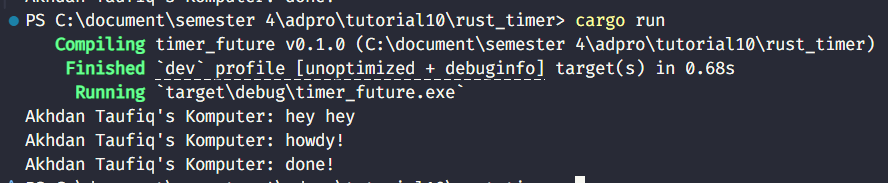
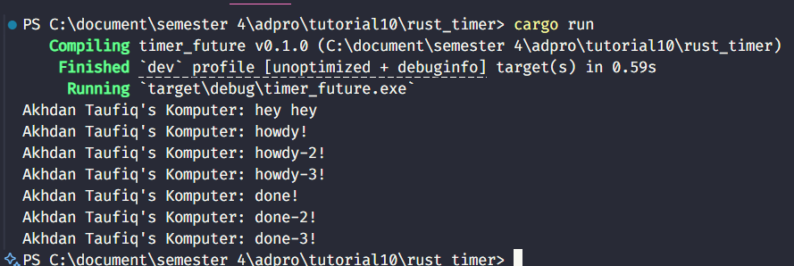

# 1.2 Understanding how it works

Saat program dijalankan, output yang muncul mengikuti urutan "Akhdan Taufiq's Komputer: hey hey", lalu "howdy!", dan setelah jeda 2 detik, "done!". Urutan ini terjadi karena perintah pertama dicetak secara sinkron langsung di fungsi `main()`, sementara dua pesan berikutnya berasal dari task asynchronous yang dijalankan oleh executor. Setelah task dijadwalkan, executor mengeksekusi bagian pertama dari blok async dan mencetak "howdy!", lalu eksekusi dihentikan sementara oleh `TimerFuture::new(Duration::new(2, 0)).await`. Timer ini bekerja secara non-blocking dan setelah waktu tunggu selesai, waker membangunkan kembali task tersebut sehingga executor bisa melanjutkannya dan mencetak "done!". Mekanisme ini mencerminkan bagaimana Rust memisahkan eksekusi sinkron dan asinkron dengan efisien, tanpa memblokir thread utama.

# 1.3 Multiple Spawn and removing drop.

Output berurutan seperti "howdy!", "howdy2!", "howdy3!", hingga "done3!" terjadi karena executor mengeksekusi beberapa task async yang dijadwalkan lewat `spawn`. Masing-masing task mencetak pesan awal sebelum masuk ke status `Pending` saat menunggu `TimerFuture`. Karena `drop(spawner)` dihapus, executor tetap aktif dan menunggu task meskipun antrean kosong, namun tidak menimbulkan masalah karena semua task sudah dikirim sebelumnya. Executor memproses task satu per satu secara bergiliran dalam satu thread, lalu melanjutkan task yang tertunda saat dibangunkan oleh `waker`. Ini menunjukkan cara kerja asynchronous Rust yang efisien tanpa blocking thread utama.
